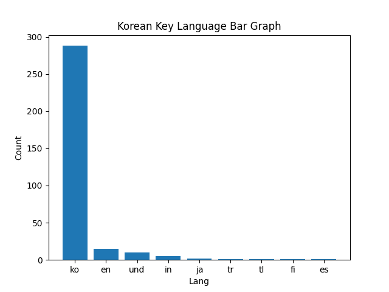
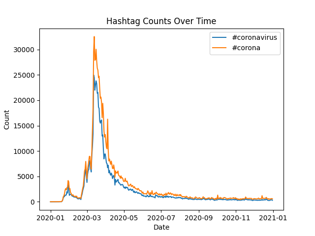

# Coronavirus Twitter Analysis (MapReduce)

## Project Summary

This project analyzes 1.1 billion geotagged tweets from 2020 to study how coronavirus-related hashtags spread across languages, countries, and over time.

Using a MapReduce-style parallel processing pipeline in Python, I processed large-scale compressed JSON data, extracted multilingual hashtag usage, and aggregated results by language and country. The system was designed to scale efficiently using Unix process control (`nohup`, background jobs) to parallelize daily tweet processing.

The final results were visualized using Matplotlib, including both geographic comparisons and time-series trend analysis.

---

## What I Built

### 1. Scalable Data Pipeline
- Implemented a **MapReduce workflow** in Python
- Parsed compressed daily tweet archives (~1.1B tweets total)
- Extracted hashtag usage by:
  - Language (`lang`)
  - Country (`place.country_code`)
- Aggregated results across the entire year

### 2. Global Hashtag Analysis (Bar Charts)

The following visualizations were generated:

- `coronavirus_lang_bar_graph.png' 
  → Top 10 languages using **#coronavirus**
  

- `coronavirus_country_bar_graph.png`  
  → Top 10 countries using **#coronavirus**
  

- `코로나바이러스_lang_bar_graph.png`
  → Top 10 languages using **#코로나바이러스**
  

- `코로나바이러스_country_bar_graph.png`  
  → Top 10 countries using **#코로나바이러스**
  

These plots show how COVID-related discussions differed geographically and linguistically across the world during 2020.

### 3. Temporal Trend Analysis (Alternative Reduce)

I designed and implemented an additional analysis pipeline (`alternative_reduce.py`) that scans all mapper outputs and constructs a time-series dataset for selected hashtags.

This program:
- Accepts a list of hashtags from the command line
- Scans the yearly mapper outputs
- Aggregates daily counts
- Generates a multi-line time-series plot where:
  - The x-axis is the day of the year
  - The y-axis is the number of tweets
  - Each line represents a different hashtag

This visualization highlights major spikes and waves in discussion throughout 2020, revealing how public attention evolved over time.

---

## Technical Skills Demonstrated

- Large-scale data processing
- MapReduce paradigm
- Parallel execution in Unix
- JSON parsing at scale
- Handling multilingual text
- Time-series data aggregation
- Data visualization with Matplotlib
- Writing production-style Python scripts

---

## Why This Project Is Relevant

This project demonstrates my ability to design and implement scalable data systems that operate on billion-scale datasets. It mirrors real-world data engineering workflows used in industry, where efficiency, robustness, and clarity of analysis are critical.
